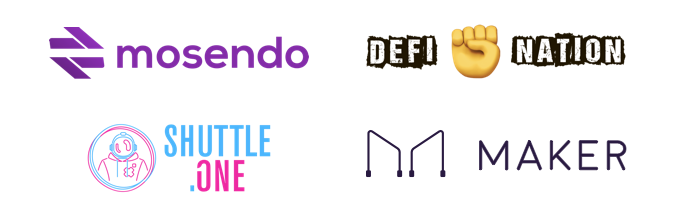

# Making open money accessible to all

Folks building in the cryptocurrency space are generally aligned with the vision of a world where open and self sovereign money is widespread and easy for anyone to use. While some may disagree on exactly what "open" or "money" is, all are united in the desire to make open money ubiquitous.

In the process of building open money systems, we found that while the money is open and programmable by anyone, the product development process at the various projects in the space is closed off and siloed.

This means that a lot of critical knowledge around technical experimentation, user research, market needs, and other product related learnings, are often siloed and in-accessible, the opposite of "open".

The Open Money DAO aims to fix this coordination problem by open sourcing and decentralizing the product development process.

Instead of building solutions in a silo, the Open Money DAO will create an Open Money System that is usable by non-technical people and take it to market, all while openly sharing and engaging folks to join in the building process.

The first phase of this experiment is to bring many ecosystem participants, some of whom may be considered "competitors", to contribute their learnings to this knowledge base of user needs and potential market segments for Open Money adoption.

By using a DAO mechanism, participants can safely fund research and experiments that further the overall knowledge of the DAO without fear that their funds may be used exclusively to benefit potential competitors.

Current contributors to OMD and this knowledge base include:

