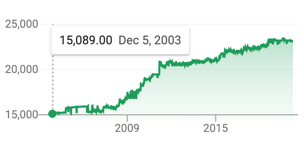

# Vietnam

[Vietnam](https://en.wikipedia.org/wiki/Vietnam) is a fast growing emerging market country with strength in agricultural and industrial exports.

| **Country** | Govt | Population | [GDP](https://en.wikipedia.org/wiki/Gross_domestic_product) / Capita | GDP \([PPP](https://en.wikipedia.org/wiki/Purchasing_power_parity)\) / Capita | Currency | Capital Controls |
| :--- | :--- | :--- | :--- | :--- | :--- | :--- |
| Vietnam | Socialist | 95m | $2,740 | $8,066 | VND | Yes |

**Inflation:** The government currency, dong \(VND\), has remained relatively stable recently after devaluing dramatically in earlier decades. The VND price against USD has decreased only 12% in past 9 years, and yearly inflation has fluctuated between 0% - 7%. The currency is not free floating and the price is set by the central bank, unofficially pegged to USD.

**Capital Controls:** The country has strict capital controls and it is not possible to send money out of the country without bank/state approval for the following reasons: paying an invoice, repaying debt + interest, paying dividends.

**Send -** Despite capital controls, there are various services that enable sending money out of the country, including invoice/lending schemes and hawala type networks. Rates are rarely higher than 3% and as low as 0.5%.

**Spend -** Most of the country still uses cash and has not made the leap to digital. Card machines are only found at higher end merchants. Most folks can only access Debit cards from their banks is there is not an established credit rating system. Most credit cards available are fully secured by cash deposits. Foreign transaction fees on cards are usually less than 1%.

**Store -** Currency devaluation has not been a problem recently but it is still fresh in their memories from previous decades. Most keep their savings in USD cash, gold, and real estate to hedge against currency risk. Banks deposits are not 100% insured and from time to time, bankers run off with the balance sheet and depositors suffer "bail in" losses on their deposits, causing people to be wary of keeping too much money in banks.

**Save -** Banks offer term deposit interest rates between 5%-8%, priced in VND. Real Estate prices have been on a long bull run and have increased dramatically in recent years, fueling speculation. US stocks are not available to most, some invest in the small local stock exchange.

**Earn -** Growing outsourcing industry for IT and Back Office workers. Some receive payments directly from overseas. Larger companies typically setup a local office for handling employment operations.

